# Conversational Agent App


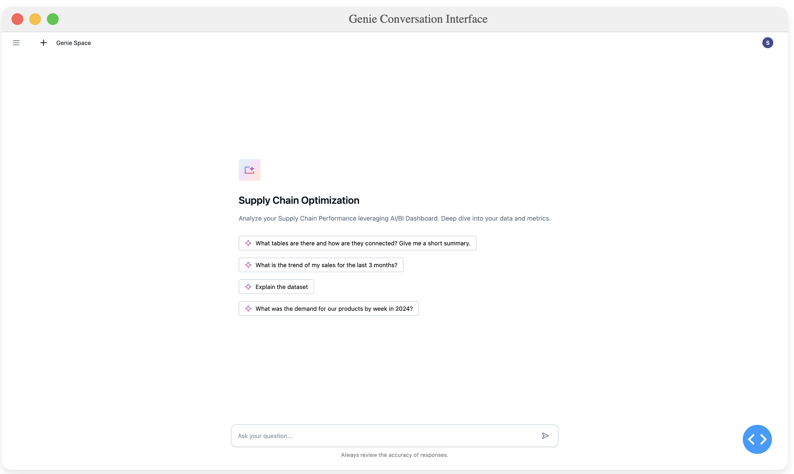
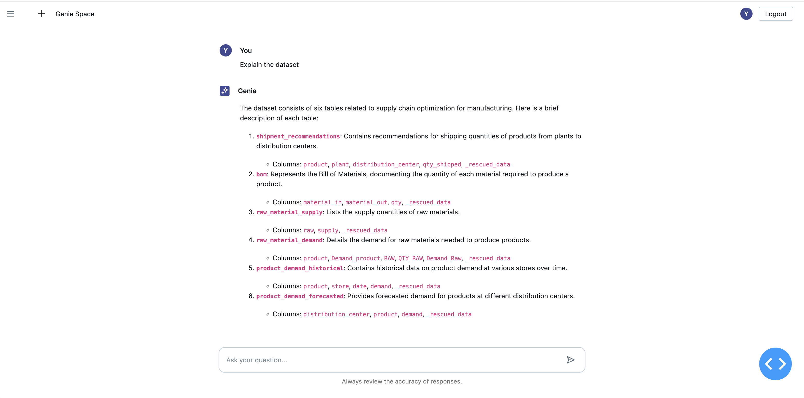
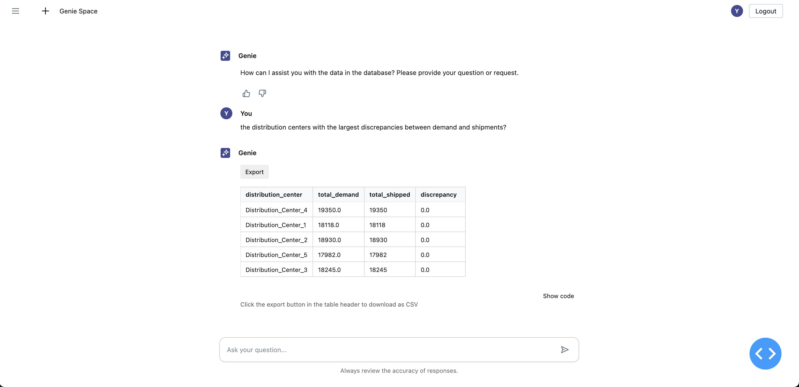

This repository demonstrates how to integrate Databricks' AI/BI Genie Conversation APIs into custom Databricks Apps applications, allowing users to interact with their structured data using natural language.

You can also click the Generate insights button and generate deep analysis and trends of your data.
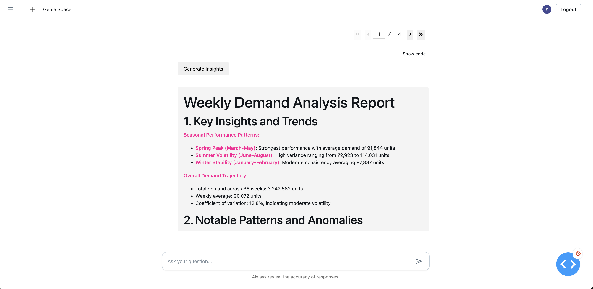
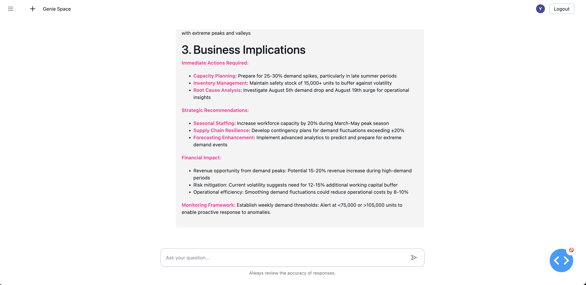


## Overview

This app is a Dash application featuring a chat interface powered by Databricks Genie Conversation APIs, built specifically to run as a Databricks App. This integration showcases how to leverage Databricks' platform capabilities to create interactive data applications with minimal infrastructure overhead.

The Databricks Genie Conversation APIs (in Public Preview) enable you to embed AI/BI Genie capabilities into any application, allowing users to:
- Ask questions about their data in natural language
- Get SQL-powered insights without writing code
- Follow up with contextual questions in a conversation thread

## Key Features

- **Powered by Databricks Apps**: Deploy and run directly from your Databricks workspace with built-in security and scaling
- **Zero Infrastructure Management**: Leverage Databricks Apps to handle hosting, scaling, and security
- **Workspace Integration**: Access your data assets and models directly from your Databricks workspace
- **Natural Language Data Queries**: Ask questions about your data in plain English
- **Stateful Conversations**: Maintain context for follow-up questions

## Example Use Case

This demo shows how to create a simple interface that connects to the Genie API, allowing users to:
1. Start a conversation with a question about their supply chain data
2. View generated SQL and results
3. Ask follow-up questions that maintain context

## Deploying to Databricks apps

1. Clone the repository to workspace directory such as 
/Workspace/Users/wenwen.xie@databricks.com/genie_space
```bash
git clone https://github.com/vivian-xie-db/genie_space.git
```
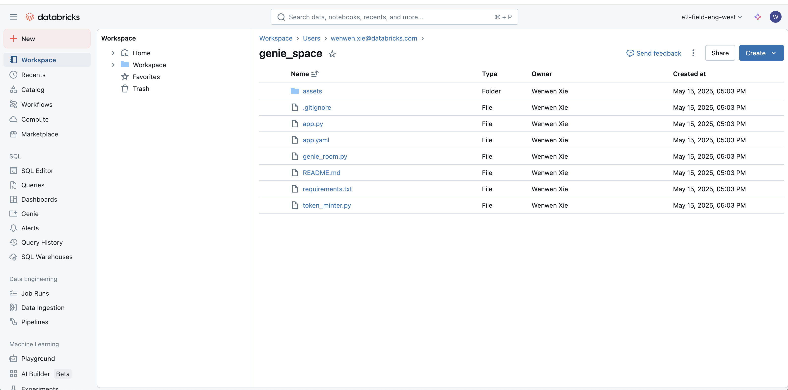


2. Change the "SPACE_ID" environment value to the ID of your Genie space, for example, 01f02a31663e19b0a18f1a2ed7a435a7 in the app.yaml file in the root directory and add 
a model serving endpoint in App resources for adding a model for insights generation:

```yaml
command:
- "python"
- "app.py"

env:
- name: "SPACE_ID"
  value: "space_id"
- name: "SERVING_ENDPOINT_NAME"
  valueFrom: "serving_endpoint"

```
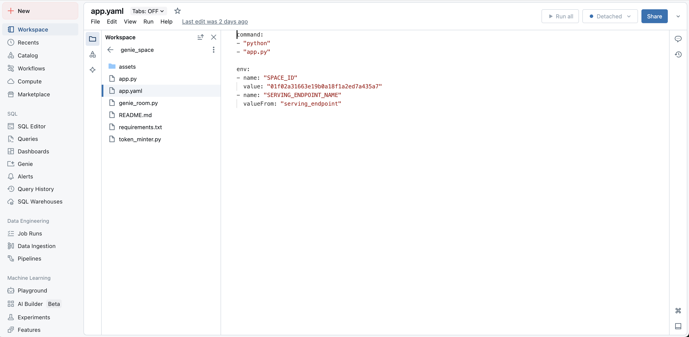
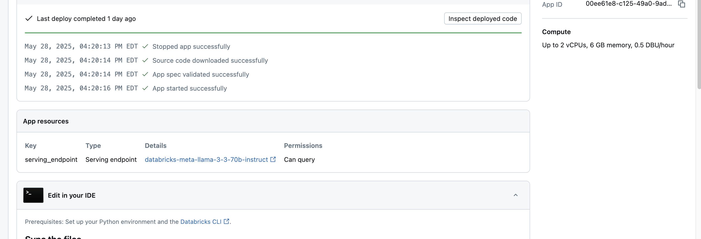

3. Create an app in the Databricks apps interface and then deploy the path to the code

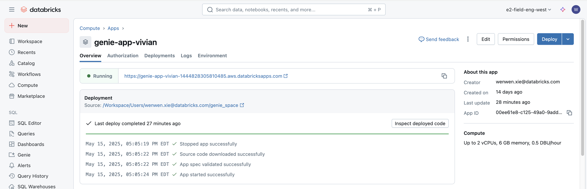

4. Grant the service principal can_run permission to the genie space.
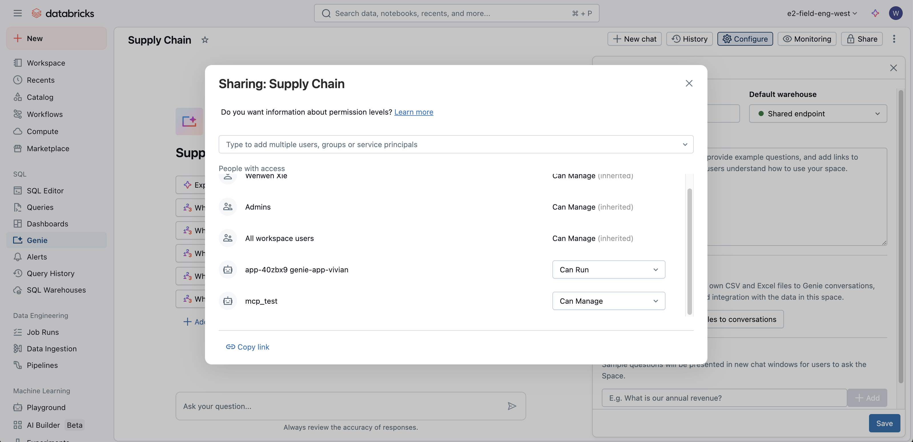

5. Grant the service principal permission can_use to the SQL warehouse that powers genie

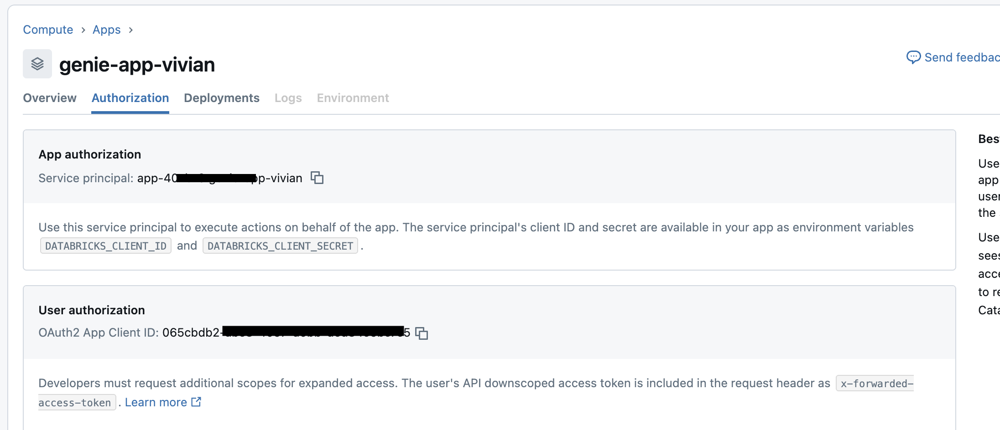


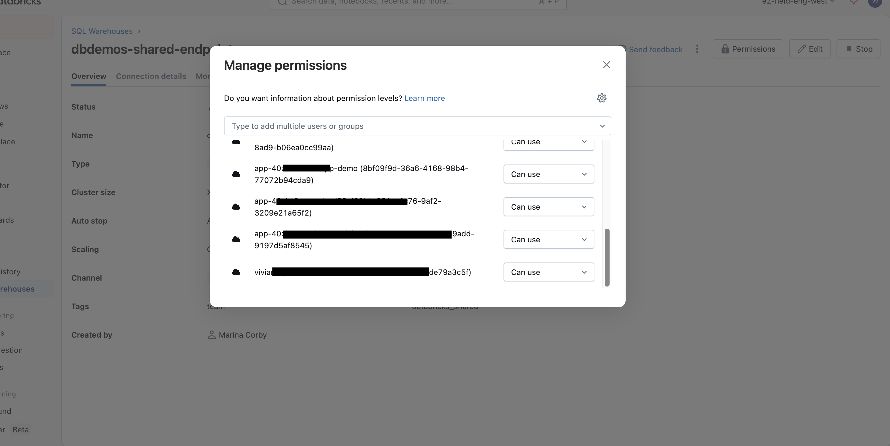

6. Grant the service principal appropriate privileges to the underlying resources such as catalog, schema and tables.

   note: I am using ALL PRIVILEGES for demo purpose but you can do use catalog on catalog, use schema on schema and select on tables

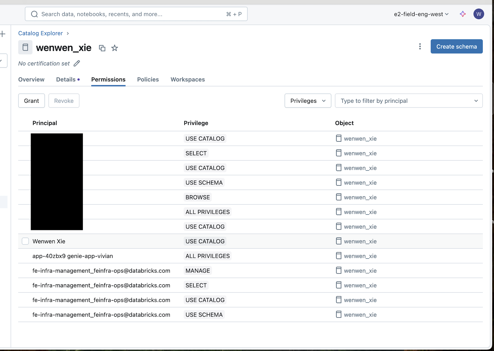

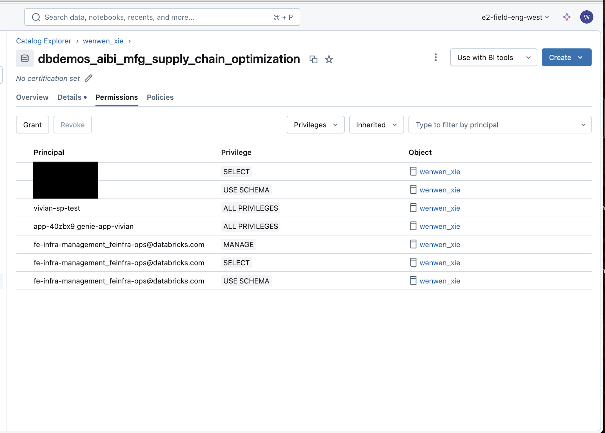

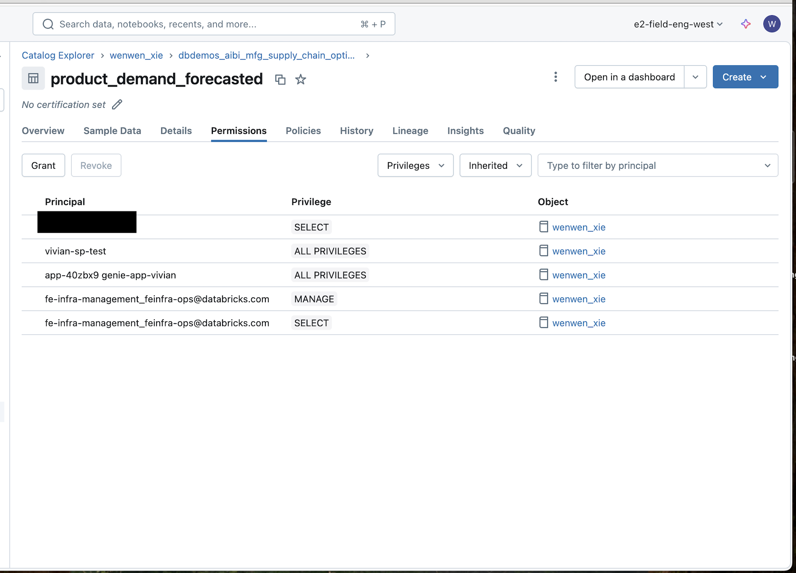

6. Troubleshooting issues:
   
   For trouble shooting, navigate to the genie room monitoring page and check if the query has been sent successfully to the genie room via the API. 

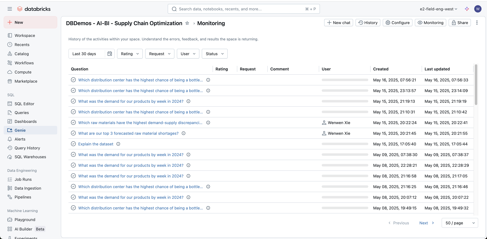

   Click open the query and check if there is any error or any permission issues.


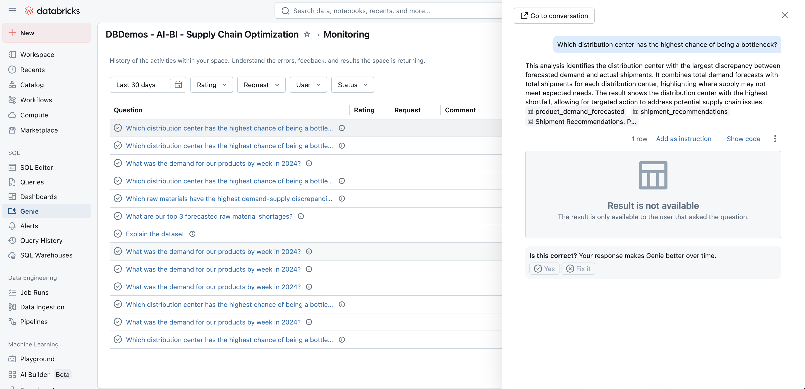


## Resources

- [Databricks Genie Documentation](https://docs.databricks.com/aws/en/genie)
- [Conversation APIs Documentation](https://docs.databricks.com/api/workspace/genie)
- [Databricks Apps Documentation](https://docs.databricks.com/aws/en/dev-tools/databricks-apps/)